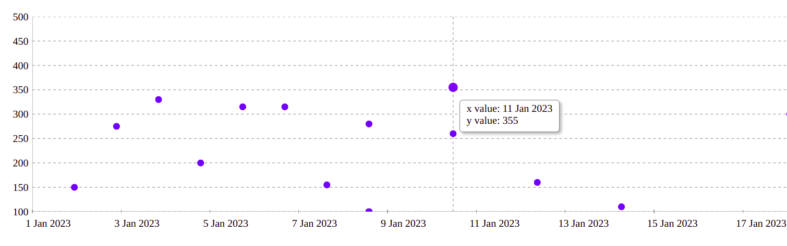

# React Scatter Graph

<a href="https://www.npmjs.com/package/@keyvaluesystems/react-scatter-graph"></a> <a href="https://www.npmjs.com/package/@keyvaluesystems/react-scatter-graph" ></a> <a href="https://github.com/KeyValueSoftwareSystems/@keyvaluesystems/react-scatter-graph"></a>

<div align="center">

</div>

A fully customizable, ready to use scatter graph UI package for React.
Try tweaking React Scatter Graph using this codesandbox link <a href="https://codesandbox.io/s/stupefied-currying-ornk52" >here</a>

## Installation

```bash
npm install @keyvaluesystems/react-scatter-graph
```

You’ll need to install React separately since it isn't included in the package.

## Usage

React Scatter Graph can run in a very basic mode like this:

```jsx
import React, { useState } from 'react';
import ReactScatterGraph from '@keyvaluesystems/react-scatter-graph';

function App() {
  data = [
    { x: 450, y: 150 },
    { x: 360, y: 330 },
    { x: 650, y: 315 },
    { x: 270, y: 200 }
  ];

  return <ScatterGraph data={data} graphHeight={500} />;
}

export default App;
```

The `data` array is an array of objects with { x, y } coordinates.

> Note: The graph width is responsive. So it can be adjusted by a parent wrapper. You need to provide the height.

### React Scatter Graph for date inputs:

Scatter graph is a useful tool for plotting date values. In order to do so, timestamps must be provided for the x-axis values.

<div align="center">

</div>

```jsx
import React, { useState } from 'react';
import ReactScatterGraph from '@keyvaluesystems/react-scatter-graph';

function App() {
  data = [
    // x given in milliseconds corresponding to the date
    { x: 1672876800000, y: 150 },
    { x: 1673568000000, y: 330 },
    { x: 1674086400000, y: 315 },
    { x: 1673222400000, y: 200 }
  ];

  return <ScatterGraph data={data} graphHeight={500} />;
}

export default App;
```

## v2.0.0 (Major Version Change)

This release includes a breaking change. Please read this document carefully before upgrading

### Breaking Changes

- The `axisColor` prop has been renamed to `gridLineColor`.

### Migration Steps

- Update Prop: Replace the prop `axisColor` with the name `gridLineColor`.

<b>Before</b>

```jsx
<ScatterGraph data={data} graphHeight={500} axisColor='#00FF00' />
```

<b>After</b>

```jsx
<ScatterGraph data={data} graphHeight={500} gridLineColor='#00FF00' />
```

## Props

Props that can be passed to the component are listed below:

<table>
  <thead>
    <tr>
      <th>Prop</th>
      <th>Description</th>
      <th>Default</th>
    </tr>
  </thead>
  <tbody>
    <tr>
      <td><code><b>data:</b> object[]</code></td>
      <td>An array of x-y coordinates to render.</td>
      <td><code>undefined</code></td>
    </tr>
    <tr>
      <td><code><b>graphHeight:</b> number</code></td>
      <td>Height of graph in pixel</td>
      <td><code>undefined</code></td>
    <tr>
      <td><code><b>gridLineColor:</b> string</code></td>
      <td>Color for the grid lines on the x and y axes. It helps user to see the exact value of a point on the graph</td>
      <td><code>#9E9E9E</code></td>
    </tr>
    <tr>
      <td><code><b>originAxisColor:</b> string</code></td>
      <td>Color for the origin axis</td>
      <td><code>#9E9E9E</code></td>
    </tr>
    <tr>
      <td><code><b>renderYLabel?:</b> (arg: number | string): string</code></td>
      <td>
        Render function for customizing Y axis label
      </td>
      <td><code>undefined</code></td>
    </tr>
        <tr>
      <td><code><b>renderXLabel?:</b> (arg: number | string): string</code></td>
      <td>
        Render function for customizing X axis label
      </td>
      <td><code>undefined</code></td>
    </tr>
    <tr>
      <td><code><b>scatterPointColor?:</b> (arg: { x: number, y: number }): string</code></td>
      <td>
        Function for customizing scatter point color. Based on the args, we can customise the color. Return value should be the color hash / string.
      </td>
      <td><code>undefined</code></td>
    </tr>
    <tr>
      <td><code><b>renderValuebox?:</b> (x: number, y: number): ReactElement</code></td>
      <td>
        Render function for customizing the value box shown on hover.
      </td>
      <td><code>undefined</code></td>
    </tr>
    <tr>
			<td><code><b>styles?:</b> object</code></td>
			<td>Provides you with a bunch of style objects and callback functions to override the default styles.(refer 
			<a href="#style-customizations">Style Customizations</a>)
			<td><code>undefined</code></td>
		</tr>
  </tbody>
</table>

<a name="style-customizations"></a>

## Style Customizations

Style customizations can be done by overriding default styles using the `styles` prop.
The below code shows all the overridable styles using `styles` prop.

```jsx
<ScatterGraph
  data={data}
  graphHeight={500}
  styles={{
    Root?: {...styles},
    XLabel?: (xLabel) => ({...styles}),
    YLabel?: (yLabel) => ({...styles}),
  }}
/>;

```

For a more specific example, please refer the following:

```jsx
<ScatterGraph
  data={data}
  graphHeight={500}
  styles={{
    Root: {
      marginTop: 50
    },
    XLabel: () => ({
      color: 'blue'
    }),
    YLabel: () => ({
      color: 'green'
    })
  }}
/>
```

Within the `styles` prop, following keys accept a style object:

- `Root` - overrides the style of outermost container.

Within the `styles` prop, following keys accept a function that returns the desired style for each element:

- `XLabel` - overrides the style of x-axis labels.
- `YLabel` - overrides the style of y-axis labels.
